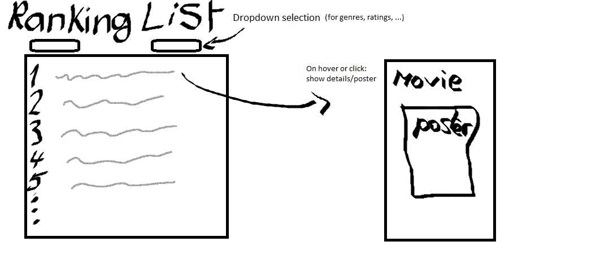
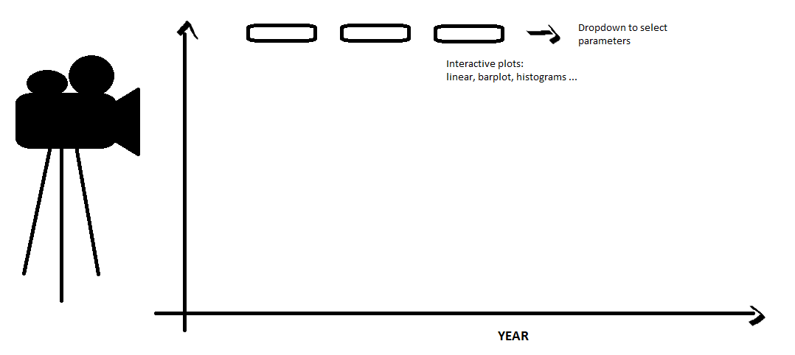

# Milestone 2 | Team Salt!

## Visualization layout of the website
The basic idea is that the visualization will have 3 parts.

First after a short text introduction of the visualization, there will be a
ranking of movies in the form of a list. One or two lists displayed at a time
with the possibility to change some attributes and do some filtering. For
instance, show top rated movies by rating or by number of votes. Filtering can
take movies per genres, per year and maybe some famous actors for example. The
movies on the list can be hovered for additional information.

Then for the second part, there will be a plot. The value of the axis can be
selected to dynamically update the plot. The idea is to observe different
evolution of the ratings, the number of votes, popularity of the genres, ...

For the third part, we want to analyze the relationship between actors. We
construct a network in which each node is an actor and there is an edge between
two actors if they have played in a movie together, with weight the number of
movies they have played together in.
Then we will use some kind of clustering algorithm (probably spectral
clustering) to see if there are interesting patterns that emerge.
We will visualize this information in the following way:
there will be a drop down menu that allows the user to select parameters for
the clustering, then a 2d picture will be created with a little dot for each
actor and it will have color based on its clustering. When hovering over a
little dot, the name of the corresponding actor will be shown. It's unclear if
computing it will be too slow on the browser so we may have to use pre-rendered
images.

## Sketch and tools
We will use d3 most likely.

The first part consist of a list where parameters can be changed. Hovering or clicking movies in the list will either show on the mouse some details or on the side.

Then for the second part there will a plot where the y-axis parameter can be chosen and it will display its evolution through the years. One idea is to have the possibilty to "slide" over the x-axis to not have all the years clumped up and only show a few years at a time. Since we are building plots, SVG will most likely be necessary for this part. The projector can simulate the animation for the transition between different plots.

## Experimental ideas
Here we will write any hard-to-implement ideas for the project if any come to
mind. If you yourself have any ideas feel free to share with us :)
